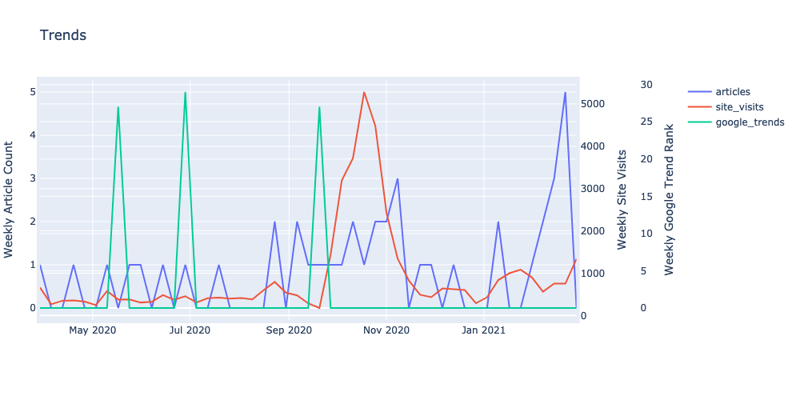
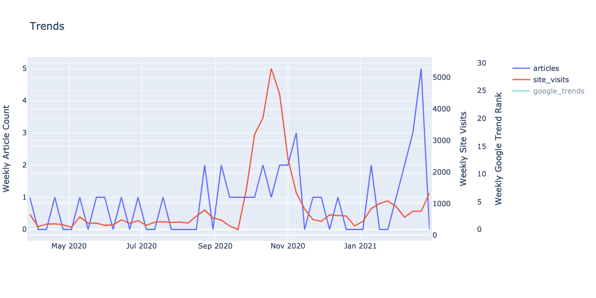
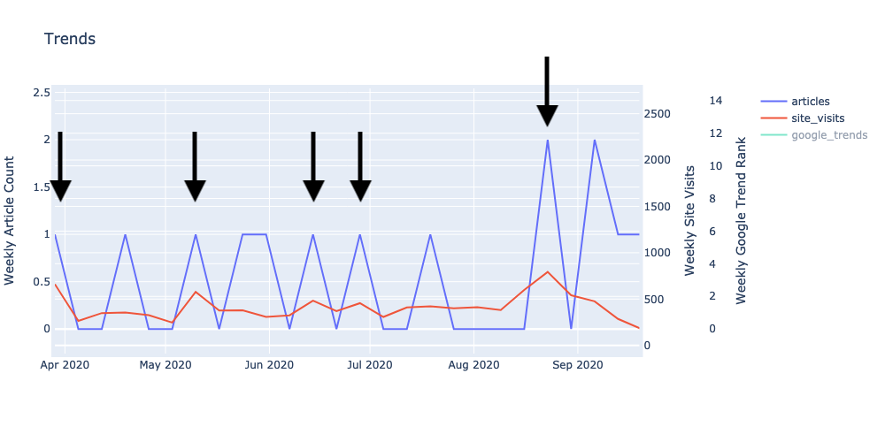

# YIMBYNews
## (3/10/21) Prelininary Findings (tl;dr):
There appears to be a correlation between _YIMBY Action_ mentions in news articles and site traffic on yimbyaction.org. Google Trends data does not appear to strongly correlate with site visits.

The degree of correlation between site visits and media mentions cannot be determined due to limitations in the current data, particularly involving data sparcity.

[(Link to interactive plot)](figs/weekly_timeseries_comparison.html)

## Overview
This analysis explores whether mentions of _YIMBY Action_ in online media articles drives traffic to yimbyaction.com, and if so to what extent. If possible, we intend to also explore relation questions like: which outlets drive the most traffic to _YIMBY Action_, what type of coverage drives the most traffic, and can we develop tooling to explore this data on an ongoing basis.

### Data Sources
- __Google Analytics__: daily site visits to yimbyaction.org. Manually downloaded as a CSV.
- __Google Trends__: prominence of "YIMBY Action" in Google search usage. Manually exported as a CSV.
- __Google News__: online news articles which mention "YIMBY Action". Programatically scrapped using the [GoogleNews](https://github.com/Iceloof/GoogleNews) Python package.

#### Data Limitations:
Google News makes programatic access difficult. Without an official API we rely on 3rd party packages to access the data. It's impossible to validate how comprehensive the results for a given time period are. Some results are missing necessary information like publication dates and outlet names.

This analysis was only able to pull Google News results from the past ~12 months, which limits our timeseries analysis considerably. In depth analysis can be found in [the relevant analytics notebook](notebooks/scrape_google_news.ipynb).

## Findings
### News Coverage and Site Traffic

Over the past year we can see that site traffic was generally at or below 1k users per week. There is a >5x increase around Oct./Nov. 2020, likely due to the Nov. 4 election.

According to Google News, there are typically anywhere from 0 to 2 articles mentioning "YIMBY Action" per week. We don't know the readership or impact of a given article. This effectively makes news coverage a binary (i.e. was YIMBY Action mentioned in the news this week, or not?) Late September to November is an exception, however, when there were 1–3 articles per week.

It appears that both site visits and news coverage experienced an "election spike" in Oct/Nov. Given the inceeased salience of YIMBY advocacy during local elections, and the release of the YIMBY voter guide it's not surprising that both trend lines should see an election bump.

If we look at the months prior to the election (April–September 2020), we see a subtle but persistant pattern where site visits (red line) tend to increase on weeks when YIMBY Action appeared in the news, and decrease on weeks when it didn't. The sample size is limited, and the data sparse, but it suggests a correlation.

### Google Trends Findings

Adding Google Trends data to our plot does not reveal any clear pattern. Google Trends doesn't represent actual number of searches  and shouldn't be taken as an exact proxy for how many people searched for "YIMBY Action" in a given week.

## Future Work
- [ ] Better news mentions data (longer time frame, more exhaustive)
- [ ] Social media engagement data (how widely shared an article is on social media may be a better predictor of traffic)
- [ ] News mentions classification (positive vs. negative coverage, coverage by different outlets with different audiences)